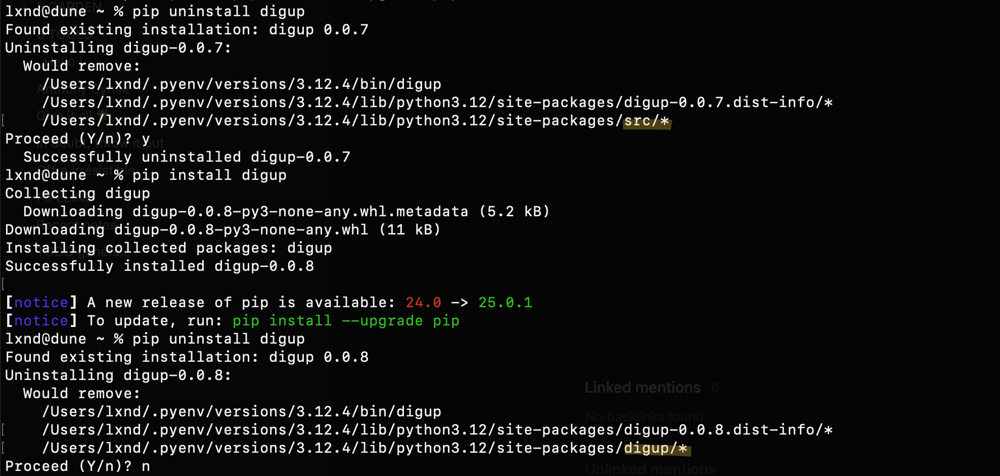

## Metas

- Date: 2025-04-22
- Author: Alexandre

## Context

I received an alert from Christophe Grosjean that my source root was improperly named:

> Attention au packaging du projet, le package pypi du script ne devrait pas installer un libpackage src.

> Le répertoire qui contient les sources devrait s'appeler digup. Dans l'état actuel quand on installe le wheel on se retrouve avec un répertoire src dans lib/python3.xx/site-packages qui contient digup. Comme si digup utilisait une librairie nommée src. Tant que l'outil n'est pas diffusé on s'en fiche, mais sur pypi si deux outils font pareils ça va générer un conflit. Donc renommer le dossier source et les modifs correspondantes dans pyproject.toml package=digup et script=digup.cli:main

> En fait si tu préfère garder un dossier src au top level dans ton projet uv, tu peux aussi créer un dossier digup comme sous dossier de src et indiquer en package src/digup dans le toml. Ce sont les deux conventions d'organisation de sources de python et uv gère les deux formats.

With his advices, I've fixed it in this commit: https://github.com/petitapetitio/digup/commit/0505134d1e7c1458cebe83da3b12ed506e0ad8e9.

I released a new version (0.0.7 -> 0.0.8). I uninstalled digup. Then re-installed it on my computer:


The lib is now installed in 
```
/Users/lxnd/.pyenv/versions/3.12.4/lib/python3.12/site-packages/digup/*
```

instead of 
```
/Users/lxnd/.pyenv/versions/3.12.4/lib/python3.12/site-packages/src/*
```

This makes more sens.